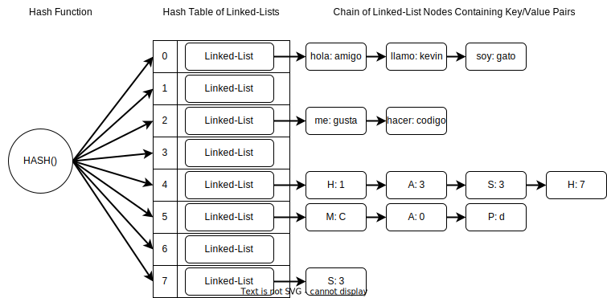
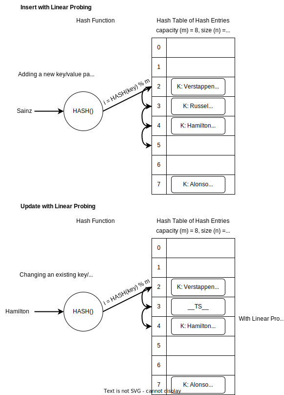

# Data Structures Final Project: Hash Table/Map

## Overview
* Data Structures final project written in `python` that implements a `HashMap` class using two different approaches for collision resolution: 
	1) Seperate Chaining (SC); and 
	2) Open Addressing (OA) with Quadratic Probing.
* The OA and SC `HashMap` classes are implemented with `DynamicArray` and singly `LinkedList` (SLL) classes that are provided in `a6_include.py`. These classes represent reduced data structures that were implemented earlier in the course.
* `HashMap` methods implemented: 
	* SC and OA:
	    * `put()` - updates an existing key or inserts a new key/value pair if the key is not found, resizing to maintain max allowable load factor constraints.
	    * `empty_buckets()` - returns the number of empty buckets.
	    * `table_load()` - returns the load factor.
	    * `clear()` - clears the hash table.
	    * `resize_table()` - resizes the hash table to a capacity that is prime numbered, copies over key/value pairs, and rehashes the links.
	    * `get()` - returns the value associated with a key.
	    * `contains_key()` - checks if a key is present.
	    * `remove()` - removes a key/value pair.
	    * `get_keys_and_values()` - returns an array of key/value tuples.
	* SC only
	    * `find_mode()` - returns the mode of an array.
	* OA only
	    * `__iter__()`, `__next__()`  - iterator implementation.

## Hash Table Concepts
* Hashmaps can be used to implement the dictionary ADT with key/value pairs.
* Think of hashmaps as basically a table of buckets or slots to hold values. 
* The principle mechanics to be understood are hashing for the insertion index, and resolution of colliding indices for different key/value pairs.
* To get the insertion index/address for a value, we hash the key (string) as follows:
	* `index = hash_func(key) % m`, where `m` is the capacity of the table.
	* Note the mod is to wrap the hash result such that `index <= m`. 
* A perfect hash function is one that results in no collisions;  in other words, every input gets a unique output.
* A minimally perfect hash function is one that results in no collisions for a table size that equals exactly the number of elements.
* A hash function that generates the same output for two different inputs results in a collision. 
* Two collision resolution approaches involve seperate chaining, and open addressing. 
* An important metric for hash table performance, tuning, and resizing determination is the load factor, defined as `λ=n/m`.
	* `λ` = load factor
	* `n` = number of elements
	* `m` = capacity of hashmap
* To keep our hash table efficient, we try to keep the `λ` less than some pre-defined threshold by periodically resizing when the load factor exceeds it. Additional restrictions apply depending on if a SC or OA implementation is used.
* We prefer prime numbers for the hash table sizes. This is becuase prime numbers are more likely to have a uniform distribution of remainders than a composite number. As a result, a prime number of buckets is less likely to have collisions than a composite number of buckets.

## Seperate Chaining Concepts

* Uses linked-lists for collision resolution.
* One or more elements can occupy the same hash bucket/slot by storing them in a linked list.
* When we hash a key to an index, we must search the linked-list for our value to decide whether to overwite an existing node, or insert a new node. If we hash to an empty linked-list, we can insert immediately.
* When using seperate chaining, a table's load factor *can* exceed 1. This is because for a given slot, a linked list can hold any number of key/value pairs limited to memory.
* For our SC implementation, we resize whenever the load factor  `λ >= 1.0`. 

## Open Addressing Concepts

* Uses open addressing for collision resolution.
* The idea is that if we stumble upon an occupied hash entry, we can probe/skip ahead to the next available slot for insertion of our value.
* We can use one of several open adressing techniques for resolution, including linear probing, [quadratic probing](https://en.wikipedia.org/wiki/Quadratic_probing), or double hashing:
	* Linear: `i = (i_initial + j) % m`
	* Qudaratic: `i = (i_initial + j ** 2) % m`
	* Double Hashing: `i = (i_initial + j * h2(key)) % m`
		* where `i_initial = h1(key) % m`, `h1, h2` are hash functions and `j=1,2,3...`
* In general, linear probing is more susceptible to clustering. Quadratic probing is somewhere between linear and double hashing in terms of performance.
* For our OA implementation, we use quadratic probing. An example sequence using quadratic probing is as follows:
	* $H+1^{2},H+2^{2},H+3^{2},H+4^{2},...,H+k^{2}$.
* To make OA work, we rely on using 'tombstones' markers. This ensures that if we remove an element $i$ that resides on a probing path for another element $j$ afther down the table, that we'll still be able to find that element $j$ later by leaving a placeholder. 
	* Basically, tombstones give us a way to preserve the cumulative state at which time a key was inserted with probing. So long as we remember that state, we maintain our ability to retrieve our elements even after removals.
* A distinction compared with SC, is that two search loops are generally needed to decide whether to insert or update a value. The first search checks for the presence of the key, and if found, udpates the value. If the key is not found, then a second search is performed to find the first available slot to insert.
	* In general, the first search ignores tombstones, and terminates when an empty slot is found.
	* The second search terminates when either a tombstone or empty slot is found. 
* When using open addressing, a table’s load factor *cannot* exceed 1 because each slot can only hold one hash entry, unlike in SC which uses linked-lists.
* However, there are only `m/2` distinct probes for a given element, requiring other techniques to guarantee that insertions will succeed when the load factor exceeds 1/2.
* Complexity
	* In general, the probability `p` that the first probe is successful is `p=(m-n)/m`
	* There are `m` total slots and `n` filled slots, so `m − n` open spots.
	* The probability of success that the c-th probe is successful is `(m−n)/(m−c) >= (m−n)/m = p`. Hence it is at least `p`.
	* The expected number of probes until success is generally: `1/p = 1/((m−n)/m) = 1/(1−n/m) = 1/(1−λ)`
	* In other words, the expected number of probes for any given operation is `O(1/(1−λ))`.
	* This means if we limit the load factor to a constant and reasonably small number, our operations will be O(1) on average. 
	* For example, if we have `λ = 0.75`, then we would expect 4 probes, on average. For `λ = 0.9`, we would expect 10 probes.
* For our OA implementation, we resize whenever the load  `λ >= 0.5`.

## Closing
* Hash maps are up there with AVL's in terms of coolness! 
* When I grow up (if I ever grow up), I want to be a hash table!
